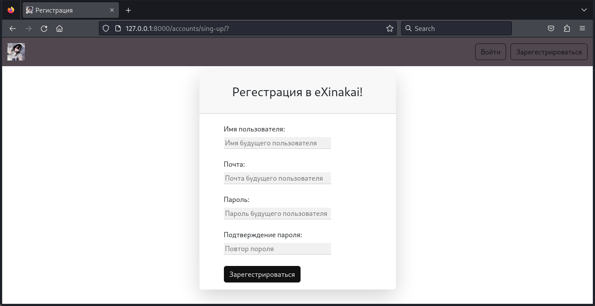
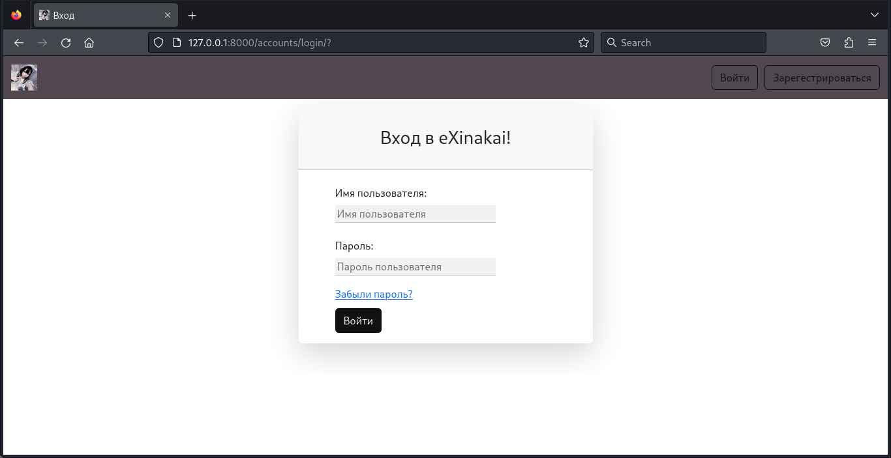
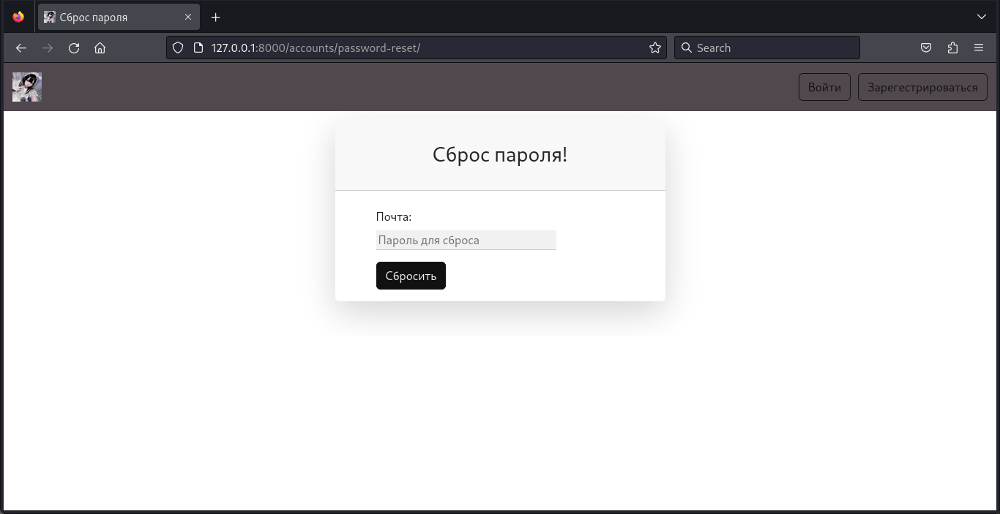
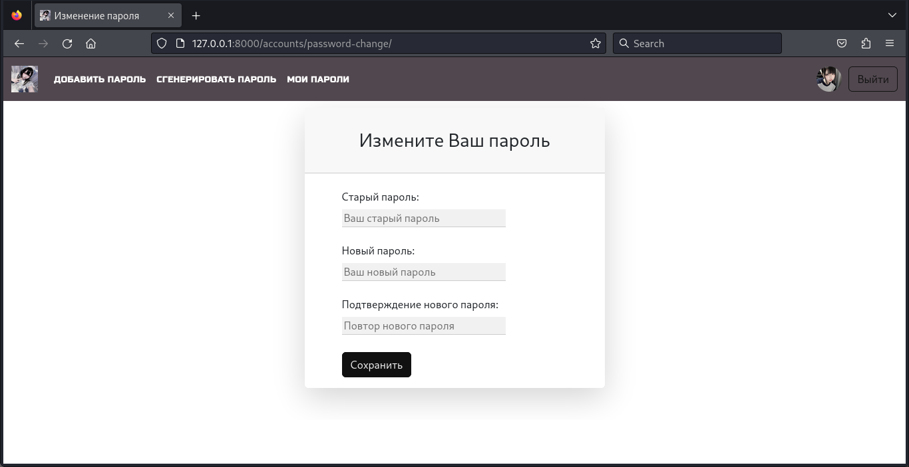
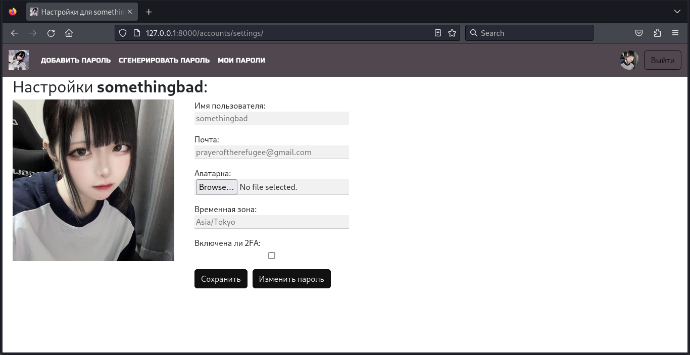
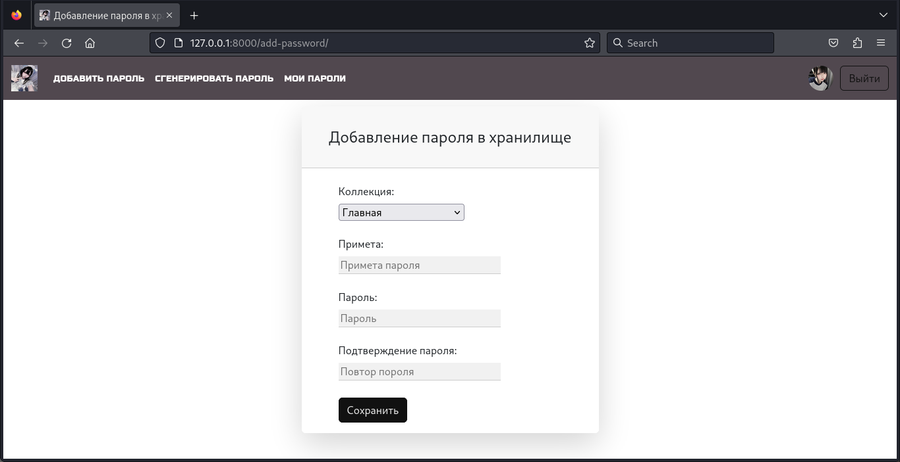
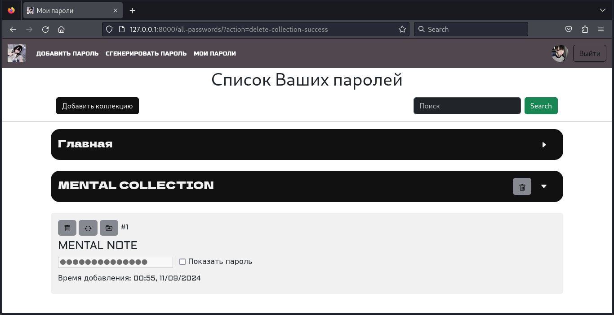

# eXinakai <a name="exinakai"></a>
Простой, минималистичный и функциональный онлайн менеджер паролей, написанный на фреймворках 
Django, Django REST Framework. Проект использует реляционную СУБД PostgreSQL в качестве основной базы данных, 
библиотеку [celery](https://github.com/celery/celery) для работы с отложенными задачами, 
нереляционную СУБД [Redis](https://github.com/redis/redis) в качестве брокера сообщений и для кэширования. 
Также применяется библиотека [dj-rest-auth](https://github.com/iMerica/dj-rest-auth) для операций с аккаунтом 
через REST API, к которому также имеется Swagger-схема, сгенерированная при помощи 
[drf-spectacular](https://github.com/tfranzel/drf-spectacular/). Программа докеризирована. 
Используемый линтер и форматер кода - [ruff](https://github.com/astral-sh/ruff).
## Карта контента <a name="table-of-contents"></a>
- [eXinakai](#exinakai)
  * [Карта контента](#table-of-contents)
  * [Быстрый старт](#quick-start)
    + [Установка](#installation)
    + [Запуск в режиме локальной разработки](#run-in-local-development-mode)
    + [Запуск в продакшен-режиме через Docker](#running-in-production-mode-via-docker)
  * [Описание функционала](#functionality-description)
    + [Работа с аккаунтом](#account-management)
    + [Менеджер паролей](#password-manager)
  * [Скриншоты](#screenshots)
    + [Работа с аккаунтом](#account-management-1)
    + [Менеджер паролей](#password-manager-1)
  * [Лицензия](#license)
## Быстрый старт <a name="quick-start"></a>
### Установка <a name="installation"></a>
```cmd
git clone https://github.com/waflawe/eXinakai.git
cd eXinakai/
```
### Запуск в режиме локальной разработки <a name="run-in-local-development-mode"></a>
1. Установка зависимостей:
```cmd
pip install requirements/dev.txt
```
2. Создаем файл .env и заполняем его по примеру файла .env.template, при необходимости
изменяя помеченные комментарием переменные.
3. Запускаем отдельно три окна терминала. В первом запускаем Redis:
```cmd
redis-server
```
4. Во втором запускаем Celery:
```cmd
source venv/bin/activate
celery -A core.celery_setup:app worker --loglevel=info
```
5. В третем запускаем проект:
```cmd
source venv/bin/activate
python manage.py runserver 0.0.0.0:8000
```
6. Переходим в интернет-обозревателе на страницу [127.0.0.1:8000](http://127.0.0.1:8000/).
7. Наслаждаемся.
### Запуск в продакшен-режиме через Docker <a name="running-in-production-mode-via-docker"></a>
1. Создаем файл .env.docker и заполняем его по примеру файла .env.docker.template, при необходимости
изменяя помеченные комментарием переменные.
2. Поднимаем Docker-compose:
```cmd
docker-compose up
```
3. Переходим в интернет-обозревателе на страницу [127.0.0.1:80](http://127.0.0.1:80/).
4. Наслаждаемся.
## Описание функционала <a name="functionality-description"></a>
### Работа с аккаунтом <a name="account-management"></a>
В eXinakai можно выполнять следующие действия с аккаунтом:
1. Регистрация
2. Авторизация
3. Сброс пароля аккаунта
4. Изменение пароля аккаунта
5. Изменение настроек аккаунта, таких как:
	- Временная зона
	- Аватар пользователя
	- Электронная почта 
	- Включение/выключение двухэтапной аутентификации через электронную почту
### Менеджер паролей <a name="password-manager"></a>
В eXinakai Ваши пароли шифруются и дешифруются ключом шифрования, выдаваемом при регистрации. 
Без ключа шифра прочитать или изменить пароли невозможно. Так же при создании нового пароля 
к нему можно добавить примету.  

Если ключ шифрования передан верно, можно выполнять следующие действия с паролями:
1. Создание паролей
2. Чтение паролей и поиск по их приметам
3. Удаление паролей  

Так же имеется встроенный гибкий генератор паролей. Он работает даже без передачи верного ключа 
шифрования, просто войдя в аккаунт.
## Скриншоты <a name="screenshots"></a>
### Работа с аккаунтом <a name="account-management-1"></a>
1. Регистрация:  
   
2. Авторизация:  
   
3. Сброс пароля аккаунта:  
   
4. Изменение пароля аккаунта:  
   
5. Изменение настроек аккаунта:  
   
6. Страница двухэтапной аутентификации:  
   
### Менеджер паролей <a name="password-manager-1"></a>
1. Создание паролей:  
   
2. Чтение паролей:  
   
3. Генерация паролей:  
   
## Лицензия <a name="license"></a>
Этот проект лицензирован [MIT лицензией](https://github.com/waflawe/eXinakai/blob/main/LICENSE).
