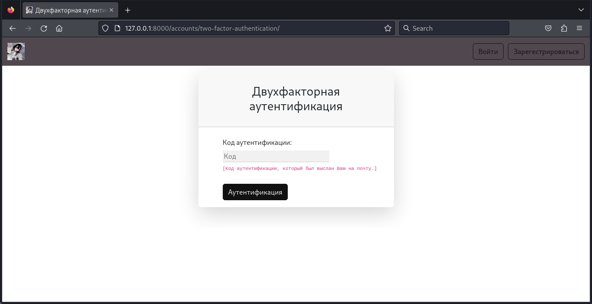

# eXinakai <a name="exinakai"></a>
A simple, minimalistic and functional online password manager written on the frameworks of 
Django, Django REST Framework. The project uses PostgreSQL relational DBMS as the main database, 
library [celery](https://github.com/celery/celery) for working with pending tasks, 
non-relational DBMS [Redis](https://github.com/redis/redis) as a message broker and for caching. 
The library [dj-rest-auth](https://github.com/iMerica/dj-rest-auth) is also used for operations with an account 
via REST API, to which there is also a Swagger schema generated using 
[drf-spectacular](https://github.com/tfranzel/drf-spectacular/). The program is dockerized. 
The linter and code formatter used is [ruff](https://github.com/astral-sh/ruff).  

__[Документация на русском языке](https://github.com/waflawe/eXinakai/blob/main/README-ru.md)__
## Table of Contents <a name="table-of-contents"></a>
- [eXinakai](#exinakai)
  * [Table of Contents](#table-of-contents)
  * [Quick Start](#quick-start)
    + [Installation](#installation)
    + [Run in local development mode](#run-in-local-development-mode)
    + [Run in production mode via Docker](#running-in-production-mode-via-docker)
  * [Functionality description](#functionality-description)
    + [Account Management](#account-management)
    + [Password Manager](#password-manager)
  * [Screenshots](#screenshots)
    + [Account Management](#account-management-1)
    + [Password Manager](#password-manager-1)
  * [License](#license)
## Quick Start <a name="quick-start"></a>
### Installation <a name="installation"></a>
```cmd
git clone https://github.com/waflawe/eXinakai.git
cd eXinakai/
```
### Run in local development mode <a name="run-in-local-development-mode"></a>
1. Install dependencies:
```cmd
pip install requirements/dev.txt
```
2. Create an .env file and fill it with the .env.template file, modifying the variables 
marked with a comment if necessary.
3. Launch three terminal windows separately. In the first one, run Redis:
```cmd
redis-server
```
4. In the second, run Celery:
```cmd
source venv/bin/activate
celery -A core.celery_setup:app worker --loglevel=info
```
5. In the third, start the project:
```cmd
source venv/bin/activate
python manage.py runserver 0.0.0.0.0:8000
```
6. Go to the [127.0.0.1:8000](http://127.0.0.1:8000/) page in your Internet browser.
7. Enjoy.
### Run in production mode via Docker <a name="running-in-production-mode-via-docker"></a>
1. Create an .env.docker file and fill it with the .env.docker.template file, if necessary
changing the variables marked with a comment.
2. Bring up Docker-compose:
```cmd
docker-compose up
```
3. Go to the [127.0.0.1:80](http://127.0.0.1:80/) page in your Internet browser.
4. Enjoy.
## Functionality description <a name="functionality-description"></a>
### Account Management <a name="account-management"></a>
In eXinakai, you can perform the following account operations:
1. Registration
2. Authorization
3. Reset account password
4. Change account password
5. Changing account settings such as:
	- Time Zone
	- User avatar
	- Email 
	- Enable/disable two-step authentication via email
### Password Manager <a name="password-manager"></a>
In eXinakai, your passwords are encrypted and decrypted with the encryption key issued at registration. 
Without the encryption key, it is impossible to read or change passwords. Also, when you create a new password,
you can add a note to it.  

If the encryption key is correct, you can perform the following actions with passwords:
1. Creating passwords
2. Read passwords and search by their signs
3. Deleting passwords  

There is also a built-in flexible password generator. It works even without passing the correct
encryption key by simply logging into your account.
## Screenshots <a name="screenshots"></a>
### Account Management <a name="account-management-1"></a>
1. Registration:  
   
2. Authorization:  
   
3. Account password reset:  
   
4. Changing the account password:  
   
5. Changing account settings:  
   
6. Two-step authentication page:  
   
### Password Manager <a name="password-manager-1"></a>
1. Creating passwords:  
   
2. Reading passwords:  
   
3. Password Generation:  
   
## License <a name="license"></a>
This project is licensed by [MIT license](https://github.com/waflawe/eXinakai/blob/main/LICENSE).
